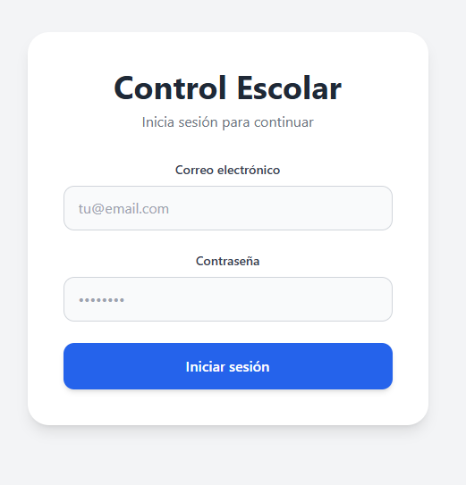
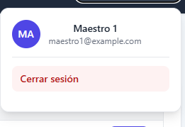
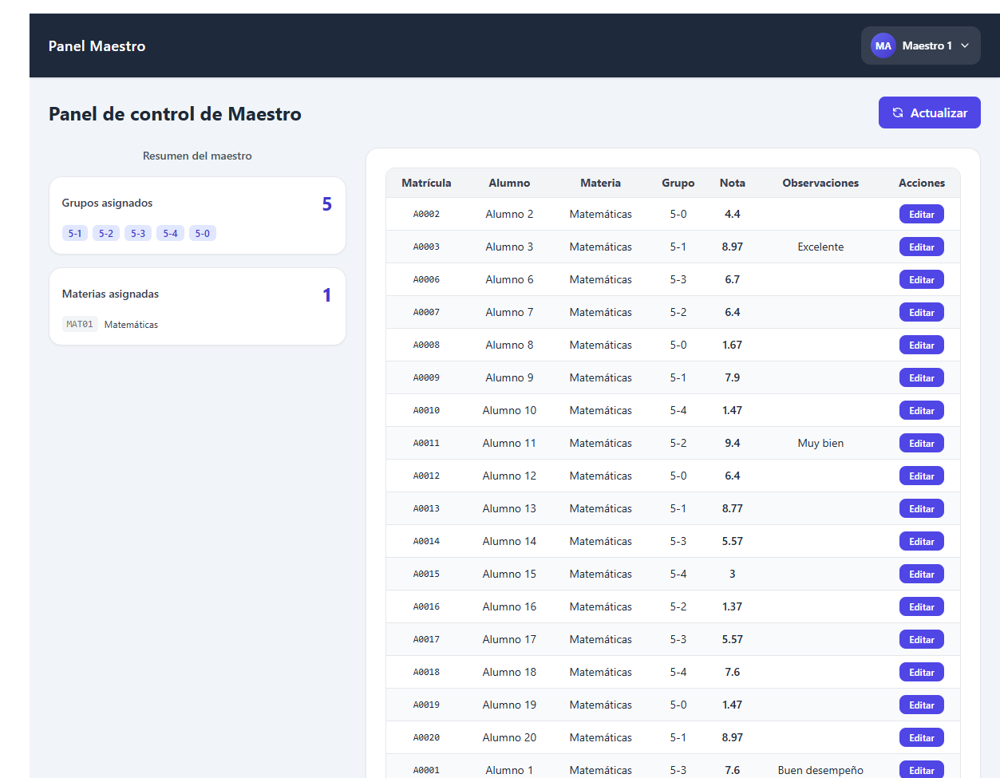
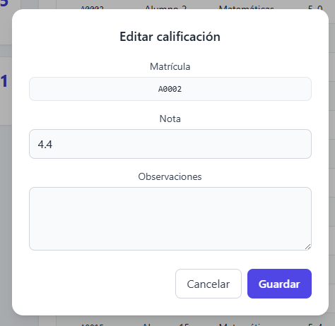
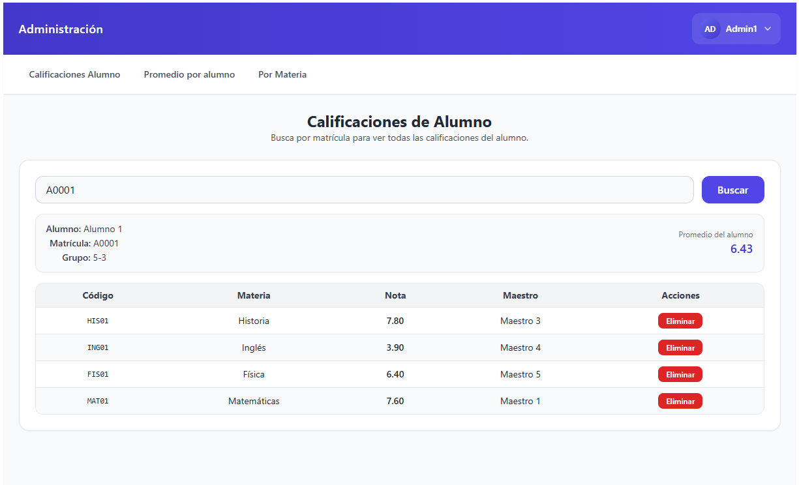
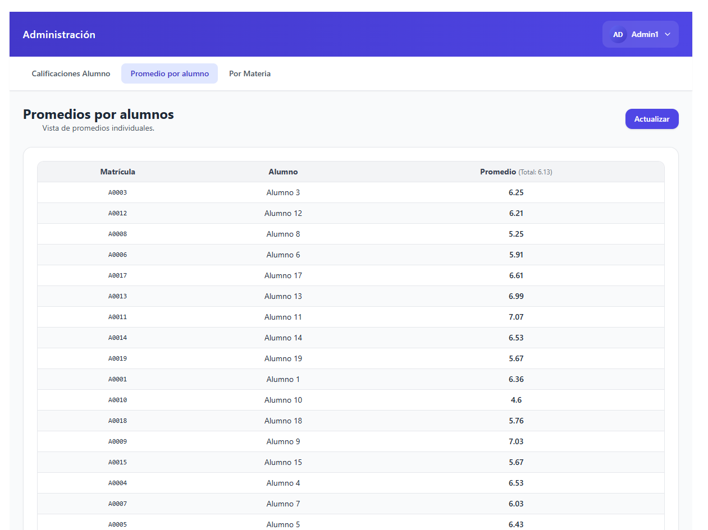
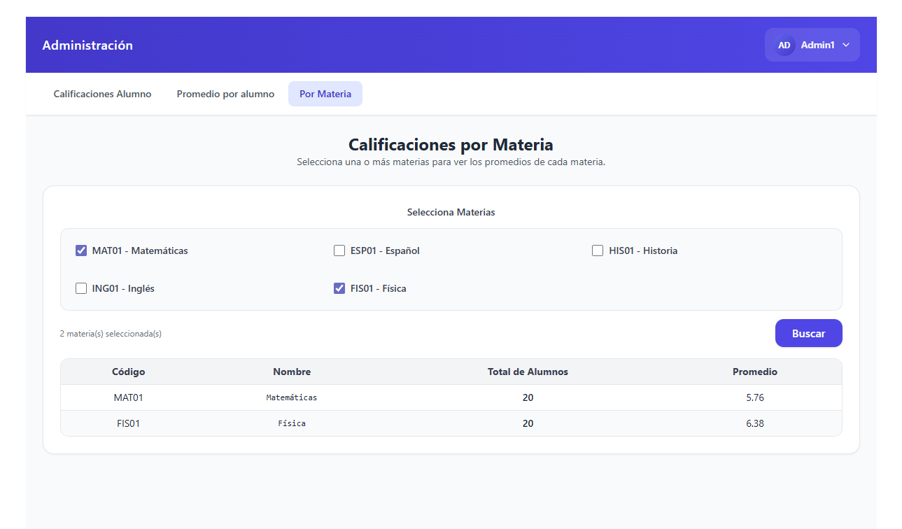

# Frontend - Sistema de Control Escolar

Frontend de la aplicación de Control Escolar desarrollado con React, TypeScript, Vite y Tailwind CSS.

## Tecnologías

- **React 18** - Biblioteca de UI
- **TypeScript** - Tipado estático
- **Vite** - Build tool y dev server
- **Tailwind CSS** - Framework CSS utility-first
- **Axios** - Cliente HTTP
- **React Router DOM** - Enrutamiento
- **Context API** - Manejo de estado global

## Estructura del Proyecto

```
src/
├── api/              # Servicios y cliente Axios
├── assets/           # Recursos estáticos
├── components/       # Componentes reutilizables
│   ├── admin/        # Componentes de admin
│   ├── maestro/      # Componentes de maestro
│   └── common/       # Componentes comunes
├── context/          # Contextos de React (AuthContext)
├── hooks/            # Custom hooks
├── layouts/          # Layouts de página
├── modules/          # Módulos por rol
│   ├── admin/        # Páginas de administrador
│   └── maestro/      # Páginas de maestro
├── pages/            # Páginas generales
├── router/           # Configuración de rutas
├── types/            # Definiciones de TypeScript
└── utils/            # Utilidades y constantes
```

## Roles y Funcionalidades

### Administrador
- Dashboard con estadísticas
- Gestión de alumnos, maestros y materias
- Gestión de grupos y periodos
- Asignación de calificaciones
- Vista de calificaciones por alumno y materia

### Maestro
- Dashboard personal
- Vista de grupos asignados
- Gestión de calificaciones de sus materias
- Vista de alumnos por grupo

## Scripts Disponibles

```bash
# Desarrollo
npm run dev

# Build para producción
npm run build

# Preview del build
npm run preview

# Linting
npm run lint

# Tests
npm run test
```

## Variables de Entorno

### Desarrollo Local (`.env`)
```env
VITE_API_BASE_URL=http://localhost:3003/api
```

### Producción Docker (`.env.production`)
```env
VITE_API_BASE_URL=/api
```

## Desarrollo Local

1. Instalar dependencias:
```bash
npm install
```

2. Configurar `.env`:
```bash
VITE_API_BASE_URL=http://localhost:3003/api
```

3. Iniciar servidor de desarrollo:
```bash
npm run dev
```

El frontend estará disponible en `http://localhost:5173`

## Build para Producción

```bash
npm run build
```

Los archivos se generan en la carpeta `dist/`

## Docker

El frontend se sirve con Nginx en producción. Ver `Dockerfile` y configuración en `nginx.conf`.

Para build con Docker:
```bash
docker build -t control-escolar-frontend .
```

## Rutas Protegidas

La aplicación usa `ProtectedRoute` para proteger rutas según el rol del usuario:

- `/admin/*` - Solo para administradores
- `/maestro/*` - Solo para maestros
- `/login` - Página pública

## Autenticación

El sistema usa JWT para autenticación. El token se almacena en `localStorage` y se incluye automáticamente en todas las peticiones mediante un interceptor de Axios.

## Componentes Principales

- **AuthContext**: Manejo de autenticación y usuario actual
- **ProtectedRoute**: Protección de rutas según rol
- **UserMenu**: Menú de usuario con logout
- **AdminLayout/MaestroLayout**: Layouts específicos por rol

## Inicio de sesión


## Panel de usuario


## Panel de Maestro


## Pantalla de cambio de calificación


## Panel de administrador


## Reporte de promedio por alumnos


## Reporte de promedio por materias
